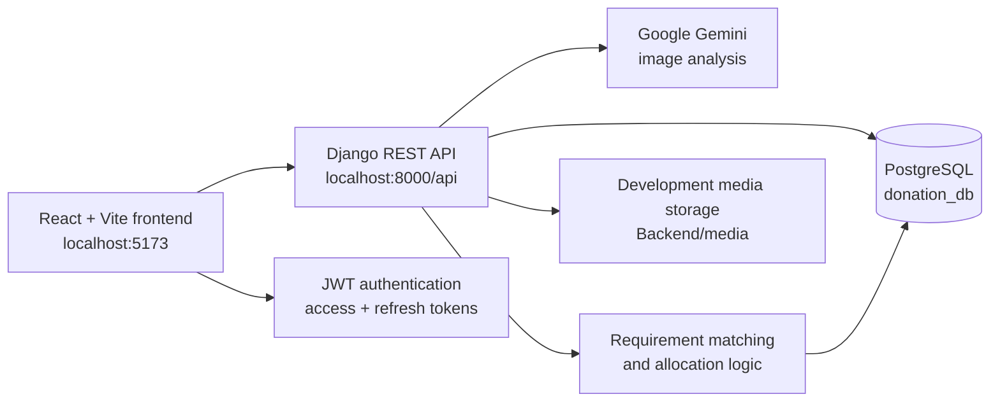
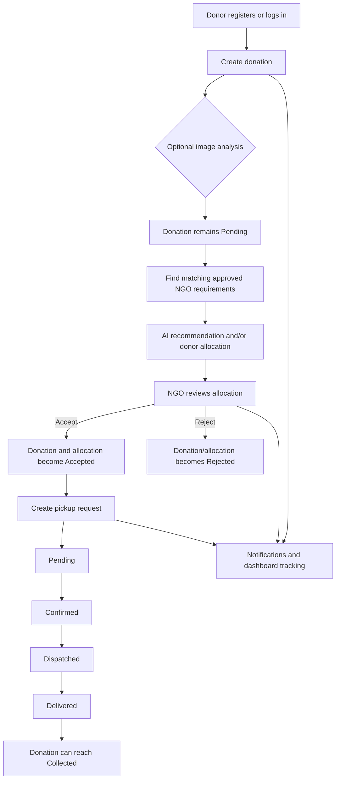
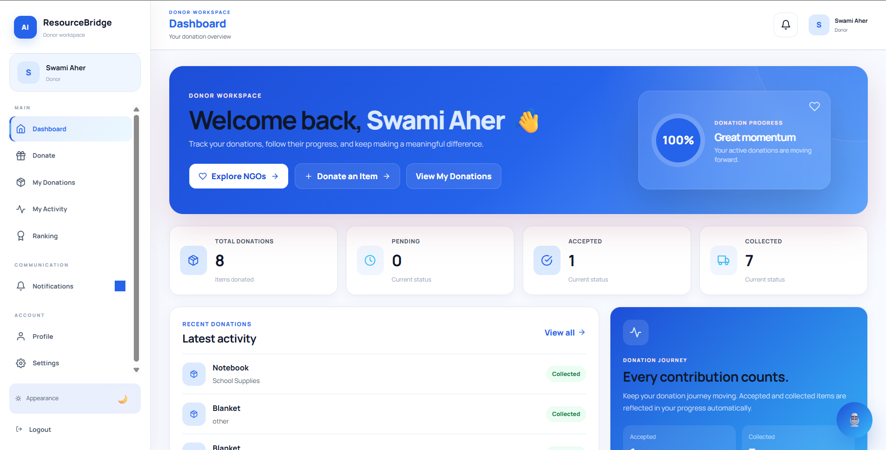
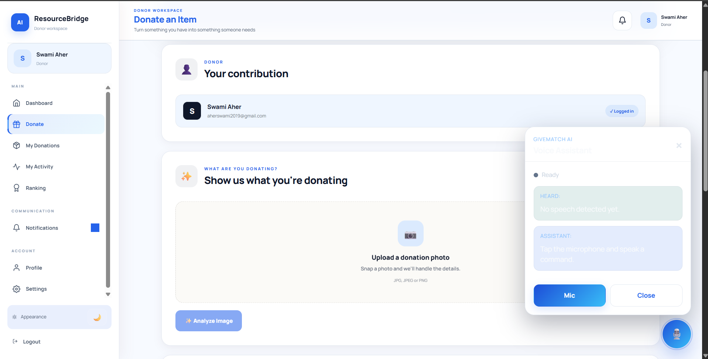
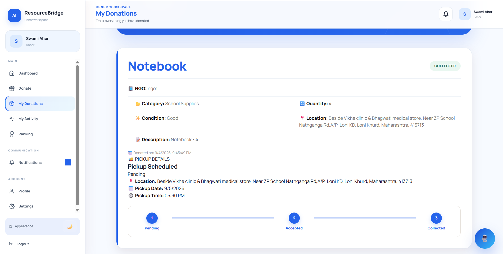
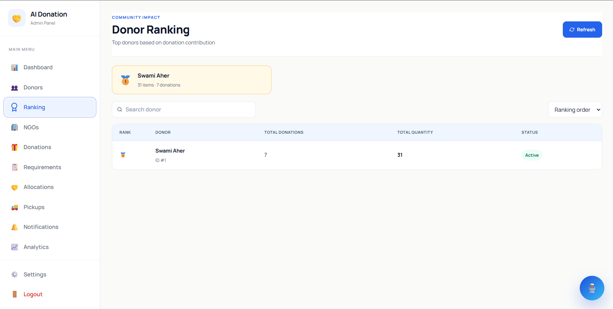
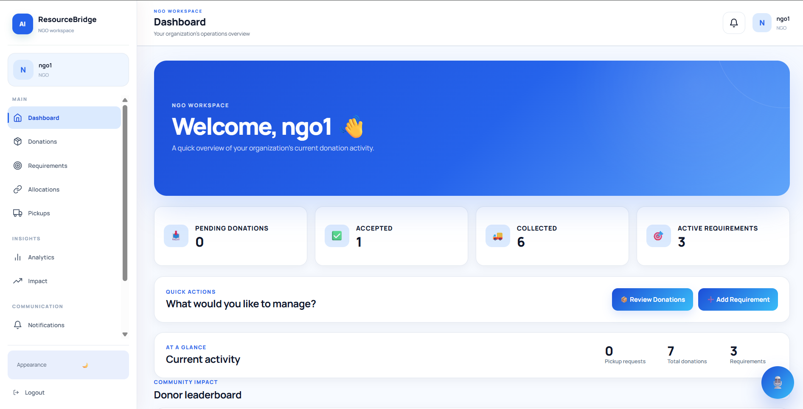
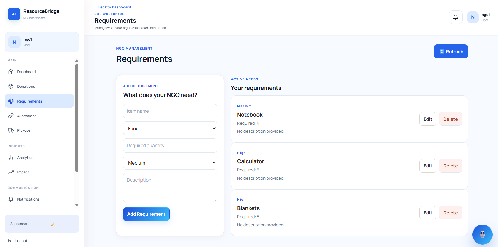
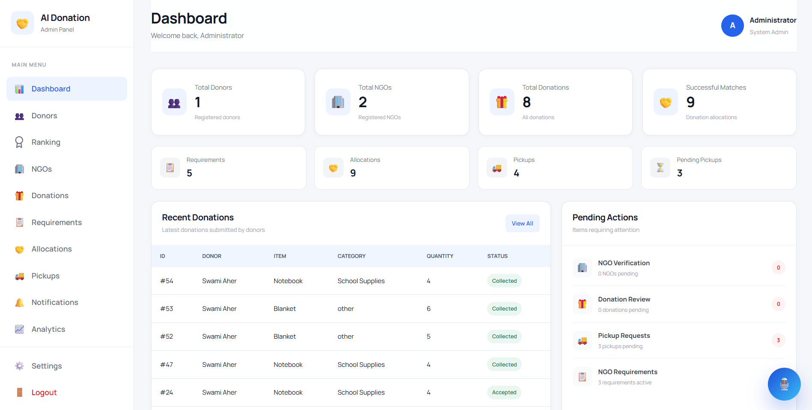

# AI-Based Donation Management System for Intelligent Resource Matching and Distribution

An AI-assisted donation management platform that connects donors, NGOs, and administrators. The application supports donation creation and tracking, NGO requirements, intelligent matching and allocation, pickup coordination, notifications, transparency through status updates, and donor ranking.

> This documentation describes the current implementation. It does not imply that the application includes payment processing, production deployment, or any other capability not present in the repository.

**Built with:** React, Vite, Django REST Framework, PostgreSQL, JWT authentication, and Google Gemini-assisted image analysis and resource matching.

## Project Highlights

- AI-assisted donation and resource matching against approved NGO requirements
- Donor, NGO, and administrator workspaces with role-aware navigation
- Donation, allocation, and pickup lifecycle tracking
- Transparent monitoring through statuses, notifications, and dashboards
- Donor ranking based on contribution data
- REST API architecture with JWT access and refresh tokens

## Project Overview

The system provides separate workspaces for donors, NGOs, and administrators. Donors can submit items, inspect approved NGOs and their requirements, receive AI-assisted matching recommendations, allocate donations, follow pickup progress, and view their ranking. NGOs can manage requirements, review incoming allocations, and coordinate pickups. Administrators can monitor platform statistics and manage donors, NGOs, donations, requirements, allocations, and pickups.

## Key Features

| Area | Implemented capabilities |
| --- | --- |
| Donors | Registration and login, dashboard, item donation creation and editing, My Donations, donation status tracking, activity view, profile and settings, NGO exploration and details, donation allocation, notifications, donor ranking, appearance/theme controls, and browser voice assistant navigation |
| NGOs | Registration and login, NGO dashboard and profile, incoming donation review, requirement creation and management, allocation view, pickup management, analytics/impact views, notifications, settings, and certificate/picture uploads |
| Administration | Dashboard statistics, donor management, NGO review and approval/rejection, donation management, requirement management, allocation management, pickup management, ranking, notifications, analytics, and settings views |
| Intelligent assistance | Gemini-powered donation image analysis and AI-assisted matching against active requirements of approved NGOs |
| Transparency and coordination | Donation, allocation, and pickup statuses; notification events; donor ranking; and dashboard summaries |

## Technology Stack

| Layer | Technologies used |
| --- | --- |
| Frontend | React 19, Vite 8, React Router, Axios, React Icons, React Toastify |
| Backend | Python, Django 6, Django REST Framework, django-cors-headers, django-filter, drf-yasg |
| Database | PostgreSQL via `psycopg2-binary`; the active settings use `donation_db` on `localhost:5432` |
| API | REST-style Django endpoints under `/api/`, with media serving in development |
| AI/ML | Google Gemini via `google-genai` usage in the AI modules, Pillow for image handling, and an Ultralytics YOLO model file (`Backend/yolo26n.pt`) present in the repository |
| Authentication | JWT access/refresh tokens via `djangorestframework-simplejwt`; the frontend sends bearer tokens and refreshes expired access tokens |
| Development tools | PowerShell, Python virtual environments, npm, Vite, ESLint, and Django migrations |

## System Architecture



## User Roles

- **Donor:** Registers, creates and edits item donations, explores approved NGOs, allocates donations to active requirements, requests or tracks pickups, receives notifications, manages a profile, and views donor ranking.
- **NGO:** Registers an organization, maintains its profile and requirements, reviews donation allocations, accepts or rejects incoming donations, and manages pickup progress.
- **Administrator:** Uses protected admin views and backend checks to review NGOs, manage donor and donation data, inspect requirements, allocations and pickups, and view dashboard statistics, ranking, notifications, and analytics.

## Application Workflow



## Project Structure

```text
AI-Donation-System/
├── Backend/
│   ├── manage.py
│   ├── requirements.txt
│   ├── donation_system/       # Active Django project, URLs, settings, views
│   ├── donor/                 # Donations, NGOs, requirements, allocations, pickups, APIs
│   ├── notifications/         # Notification model, services, signals, APIs
│   ├── users/                 # User/profile models and admin-oriented views
│   ├── ai/                    # Gemini image analysis and matching support
│   ├── media/                 # Development uploads
│   └── yolo26n.pt             # YOLO model artifact present in the repository
├── frontend/
│   ├── package.json
│   ├── vite.config.js
│   └── src/
│       ├── App.jsx            # React route and role guards
│       ├── pages/             # Donor, NGO, admin, auth, ranking and public pages
│       ├── components/        # Layouts, navigation, notifications and voice assistant
│       ├── services/          # Axios API and feature services
│       ├── context/            # Authentication, theme and ranking state
│       └── styles/             # Existing frontend styling
├── docs/
│   ├── ARCHITECTURE.md
│   ├── FEATURES.md
│   ├── SETUP.md
│   └── screenshots/           # Add real screenshots here when available
└── README.md
```

## Installation and Setup

The detailed setup guide is in [docs/SETUP.md](docs/SETUP.md). The short version for Windows PowerShell is:

```powershell
git clone <repository-url>
cd AI-Donation-System

cd Backend
python -m venv .venv
\.venv\Scripts\Activate.ps1
pip install -r requirements.txt
# Create Backend/.env with your own values before starting Django.
python manage.py migrate
python manage.py runserver
```

In a second PowerShell window:

```powershell
cd AI-Donation-System\frontend
npm install
npm run dev
```

The frontend uses `http://127.0.0.1:8000/api/` and Vite normally serves it at `http://localhost:5173`.

## Environment Variables

Create your own `Backend/.env` file. Never commit real credentials.

```dotenv
DB_PASSWORD=your_postgresql_password
GEMINI_API_KEY=your_gemini_api_key
```

The active `Backend/donation_system/settings.py` reads `DB_PASSWORD` from the process environment. The AI modules load `GEMINI_API_KEY` from `Backend/.env`. The database name, user, host, and port currently default to `donation_db`, `postgres`, `localhost`, and `5432` in Django settings.

## API / Backend

The active Django project is `Backend/donation_system`, with API routes mounted under `/api/`. The `donor` app exposes registration, login, donation CRUD/status operations, NGO discovery and details, NGO requirements, matching, AI matching, allocations, donor donations and ranking, profiles, uploads, pickups, and admin management endpoints. The `notifications` app exposes recipient-scoped notification listing, unread counts, read state, and deletion. JWT login and refresh endpoints are available at `/api/login/` and `/api/token/refresh/`.

## 📸 Application Screenshots

The following gallery presents the real screenshots currently available for the donor, NGO, and administrator interfaces. Additional screens can be added to [`docs/screenshots/`](docs/screenshots/) as they are captured.

### 👤 Donor Interface

| Screen | Description |
| --- | --- |
| Donor Dashboard | <br>Overview of donation totals, progress, recent activity, and available actions. |
| Donation | <br>Form for creating an item donation with item details, quantity, condition, location, and optional image analysis. |
| My Donations | <br>Donor donation list with status tracking, details, allocation information, and eligible actions. |
| Ranking | <br>Community donor leaderboard and contribution ranking. |

### 🏢 NGO Interface

| Screen | Description |
| --- | --- |
| NGO Dashboard | <br>Overview of incoming donations, accepted and collected items, requirements, pickups, and ranking. |
| Donation/Requirement Management | <br>Manage active NGO requirements with item details, quantities, priorities, and fulfillment information. |
| Ranking | <br>Shared donor leaderboard displayed in the NGO workspace. |

### 🛠️ Admin Interface

| Screen | Description |
| --- | --- |
| Admin Dashboard | <br>Platform statistics and recent donation activity. |
| Ranking | <br>Searchable donor contribution ranking. |

## Future Improvements

- Move all production secrets and security settings to environment-based configuration.
- Add automated API and end-to-end coverage for the main role workflows.
- Add deployment documentation and a production serving strategy for static and media files.
- Add accessibility and performance checks to the frontend workflow.
- Add richer audit history and reporting for allocation and pickup events.

## Contributors

This repository does not currently include a verified contributor roster. Contributions can be proposed through issues and pull requests following the repository's review process.

## License

No license file is currently present. Licensing should be confirmed by the project owner before adding an MIT License or another license to the repository.