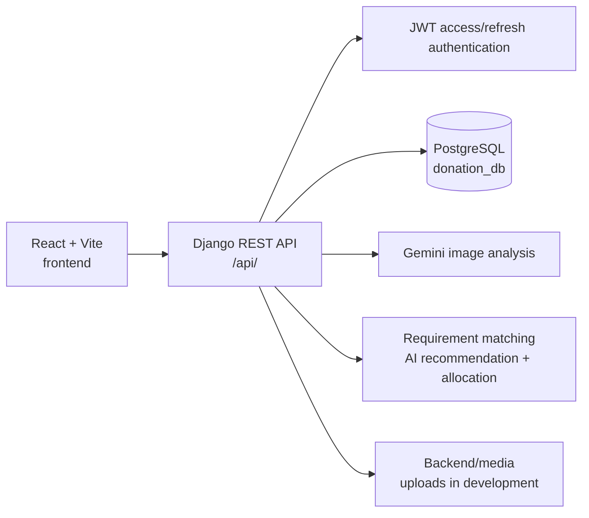

# System Architecture

## Overview

The application is a two-part local web system. The React/Vite client runs on port 5173 and calls the Django REST API on port 8000. Django persists donation, NGO, requirement, allocation, pickup, profile, and notification data in PostgreSQL. Development media files are served from `Backend/media`.



The repository also contains `Backend/ai/image_scanner.py`, `Backend/ai/gemini_detector.py`, and `Backend/yolo26n.pt`. The active donation matching endpoint calculates recommendations from approved NGO requirements using item/category compatibility, remaining quantity, priority, and quantity compatibility. Gemini is used for uploaded donation image analysis.

## Donor Workflow

1. A donor registers or logs in and receives JWT access and refresh tokens.
2. The donor creates an item donation, optionally using image analysis to identify donation items.
3. The donation starts with status `Pending`.
4. The donor can view approved NGOs, their active requirements, matching NGOs, or an AI recommendation.
5. The donor allocates all or part of a pending donation to compatible approved requirements.
6. The donor follows allocation, donation, pickup, and notification updates from the donor workspace.
7. Donor ranking is available through the ranking endpoint and frontend views.

## NGO Workflow

1. An NGO registers and maintains its profile and supporting certificate information.
2. An administrator reviews the NGO and can approve or reject it.
3. An approved NGO creates active requirements with item, category, quantity, and priority.
4. The NGO reviews incoming donation allocations.
5. The NGO accepts or rejects an allocation. Accepted allocations update the related requirement fulfillment through the existing backend workflow.
6. The NGO reviews pickup requests and updates their status through `Confirmed`, `Dispatched`, `Delivered`, or `Cancelled`.

## Admin Workflow

The frontend provides protected administrator pages for dashboard statistics, NGOs, donors, donations, requirements, allocations, pickups, ranking, notifications, analytics, and settings. Backend admin endpoints provide aggregate statistics, donor and NGO management, NGO approval/rejection, and management data. Admin operations are guarded by the existing authentication and staff/superuser checks in the backend.

## Donation Lifecycle

The implementation maintains separate statuses for donations, allocations, and pickup requests.

### Donation status

```text
Pending -> Accepted -> Collected
    \-> Rejected
```

Donation model values are `Pending`, `Accepted`, `Rejected`, and `Collected`.

### Allocation status

```text
Pending -> Accepted -> Collected
    \-> Rejected
```

An allocation connects a donation with an NGO requirement and includes an allocated quantity. A donation may have multiple allocations, subject to the existing validation rules.

### Pickup request status

```text
Pending -> Confirmed -> Dispatched -> Delivered
    \-> Cancelled
```

Pickup requests belong to an allocation and include an address, scheduled time, notes, and status. Notifications are generated for relevant donation, matching, allocation, and pickup events.

## Main Backend Boundaries

- `Backend/donation_system/`: active Django project settings and top-level URL configuration.
- `Backend/donor/`: domain models, serializers, views, routes, migrations, authentication, and donor/NGO/admin APIs.
- `Backend/notifications/`: notification model, recipient-scoped APIs, services, and signals.
- `Backend/ai/`: Gemini-backed image analysis helpers.
- `frontend/src/`: React routes, role guards, workspaces, services, contexts, and existing presentation components.
